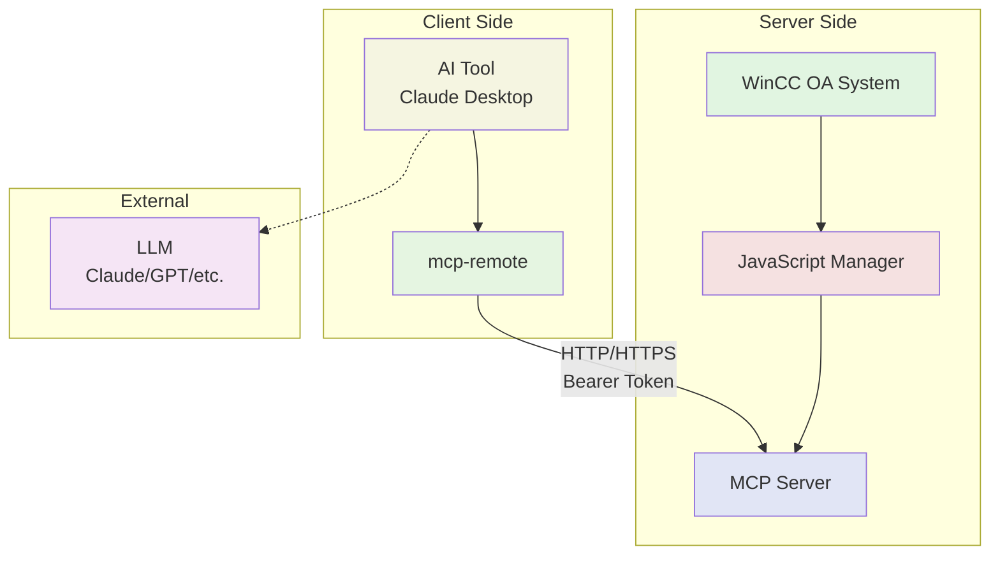

# MCP WinCC OA Server Architecture

## Overview

The MCP WinCC OA Server has been refactored from a monolithic 1340-line file into a modular architecture that improves maintainability, testability, and extensibility.

## System Architecture



### Components

- **WinCC OA System**: Industrial automation platform
- **JavaScript Manager**: WinCC OA process running our MCP server
- **MCP Server**: HTTP server with authentication and field validation
- **AI Tool**: Client application (Claude Desktop, VSCode, etc.)
- **mcp-remote**: MCP client connecting to remote HTTP server
- **LLM**: External language model for AI assistance

## Directory Structure

```
src/
├── index_stdio.js              # STDIO transport entry point
├── index_http.js               # HTTP transport entry point
├── server.js                   # Main server initialization
├── tool_loader.js              # Dynamic tool loading system
├── field_loader.js             # Field configuration loader
│
├── resources/                  # MCP resources
│   └── field_resources.js      # Field and project configuration resources
│
├── tools/                      # Tool categories
│   ├── datapoints/             # Datapoint management tools
│   │   ├── dp_basic.js         # Basic DP operations (get, list, value)
│   │   ├── dp_set.js           # DP set operations with validation
│   │   └── dp_types.js         # DP type management
│   ├── cns/                    # CNS (UNS) tools
│   │   └── cns_views.js        # CNS view management (placeholder)
│   ├── alerts/                 # Alert management tools
│   │   └── alerts.js           # Alert operations (placeholder)
│   └── system/                 # System management tools
│       └── system.js           # System operations (placeholder)
│
└── utils/                      # Shared utilities
    ├── helpers.js              # Common helper functions
    └── validation.js           # Field validation logic
```

## Core Components

### 1. Server Initialization (`server.js`)

- Creates and configures the MCP server instance
- Initializes WinCC OA connection (`winccoa` object)
- Loads field configurations
- Sets up shared context for all tools
- Provides centralized error handling

### 2. Tool Loading System (`tool_loader.js`)

- Dynamically discovers and loads tools from category directories
- Registers tools with the MCP server
- Supports modular tool organization
- Enables easy addition of new tool categories

### 3. Field Configuration System

- **Field Loader** (`field_loader.js`): Loads ETM-provided field configurations
- **Field Resources** (`resources/field_resources.js`): Exposes configurations via MCP resources
- **Validation** (`utils/validation.js`): Enforces field-specific access rules

### 4. Tool Categories

#### Datapoints (`tools/datapoints/`)
- **Basic Operations** (`dp_basic.js`): get-dpTypes, get-datapoints, get-value
- **Set Operations** (`dp_set.js`): dp-set with field validation
- **Type Management** (`dp_types.js`): dp-type-get, dp-type-name, dp-type-ref

#### CNS/UNS (`tools/cns/`)
- Currently disabled (commented out in original code)
- Placeholder structure for future implementation

#### Alerts (`tools/alerts/`)
- Currently disabled (commented out in original code)
- Placeholder structure for future implementation

#### System (`tools/system/`)
- Currently disabled (commented out in original code)
- Placeholder structure for future implementation

## Key Design Patterns

### 1. Shared Context Pattern
All tools receive a shared context object containing:
- `winccoa`: WinCC OA API instance
- `fieldConfigs`: Loaded field configurations
- `projectInstructions`: Project-specific instructions (if any)

### 2. Validation-First Approach
The `dp-set` tool demonstrates field-aware validation:
- Checks forbidden patterns (e.g., `*_SAFETY_*`)
- Enforces allowed patterns (e.g., `*_AI_Assistant`)
- Provides warnings for critical operations

### 3. Resource-Based Configuration
Field and project configurations are exposed as MCP resources:
- `field://active-instructions`: Current field configuration
- `field://project-instructions`: Project-specific overrides (if any)

### 4. Modular Tool Registration
Each tool module exports a `registerTools(server, context)` function:
- Returns the number of tools registered
- Follows consistent naming and structure
- Enables easy testing and maintenance

## Environment Variables

- **`WINCCOA_FIELD`**: Specifies the industrial field (oil, transport, default)
- **`WINCCOA_PROJECT_INSTRUCTIONS`**: Path to project-specific instruction file

## Benefits of New Architecture

1. **Maintainability**: Smaller, focused files are easier to understand and modify
2. **Testability**: Individual tool modules can be tested in isolation
3. **Extensibility**: New tools and categories can be added without touching existing code
4. **Consistency**: Shared utilities ensure consistent error handling and validation
5. **Scalability**: Tool loading system supports unlimited expansion

## Migration Notes

- Entry points (`index_stdio.js`, `index_http.js`) now use `initializeServer()` from `server.js`
- All tools maintain the same external API for backwards compatibility
- Field validation rules are preserved and enhanced with better error messages