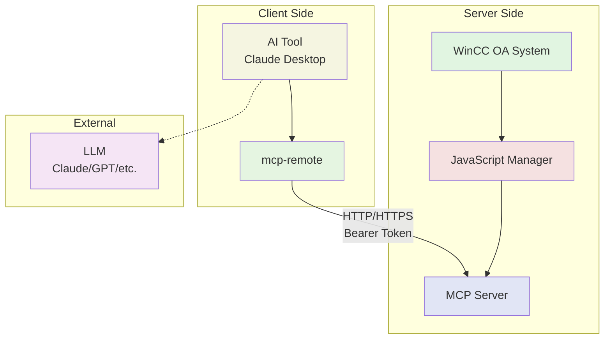

# MCP WinCC OA Server Architecture

## Overview

The MCP WinCC OA Server has been refactored from a monolithic 1340-line file into a modular architecture that improves maintainability, testability, and extensibility.

## System Architecture



### Components

- **WinCC OA System**: Industrial automation platform
- **JavaScript Manager**: WinCC OA process running our MCP server
- **MCP Server**: HTTP server with authentication and field validation
- **AI Tool**: Client application (Claude Desktop, VSCode, etc.)
- **mcp-remote**: MCP client connecting to remote HTTP server
- **LLM**: External language model for AI assistance

## Directory Structure

```
mcpWinCCOA/src/
├── index_http.ts               # HTTP transport entry point
├── index_stdio.ts              # STDIO transport entry point
├── server.ts                   # Main server initialization
├── tool_loader.ts              # Dynamic tool loading system
├── systemprompt.md             # System prompt content
│
├── config/
│   └── server.config.ts        # Server configuration
│
├── fields/                     # Industry field instructions
│   ├── default.md
│   ├── oil.md
│   └── transport.md
│
├── helpers/
│   ├── dashboards/             # Dashboard management
│   │   ├── DashboardManager.ts
│   │   ├── LayoutHelper.ts
│   │   └── WidgetFactory.ts
│   ├── drivers/                # Connection drivers
│   │   ├── BaseConnection.ts
│   │   └── OpcUaConnection.ts
│   ├── icons/                  # Icon utilities
│   │   ├── IconGenerator.ts
│   │   └── IconList.ts
│   └── pmon/                   # Process monitor client
│       └── PmonClient.ts
│
├── tools/                      # Tool categories (26 tools total)
│   ├── alarms/                 # Alarm configuration
│   │   ├── alarm_delete.ts
│   │   └── alarm_set.ts
│   ├── archive/                # Historical data
│   │   ├── archive_delete.ts
│   │   ├── archive_query.ts
│   │   └── archive_set.ts
│   ├── common/                 # Common attributes
│   │   ├── common_delete.ts
│   │   ├── common_query.ts
│   │   └── common_set.ts
│   ├── dashboards/             # Visualization
│   │   ├── dashboard.ts
│   │   └── widget.ts
│   ├── datapoints/             # Datapoint management
│   │   ├── dp_basic.ts
│   │   ├── dp_create.ts
│   │   ├── dp_set.ts
│   │   ├── dp_type_create.ts
│   │   └── dp_types.ts
│   ├── icons/                  # Icon management
│   │   └── icon.ts
│   ├── manager/                # Process control (Pmon)
│   │   ├── manager_add.ts
│   │   ├── manager_control.ts
│   │   ├── manager_list.ts
│   │   ├── manager_properties.ts
│   │   └── manager_remove.ts
│   ├── opcua/                  # OPC UA integration
│   │   ├── opcua_address.ts
│   │   └── opcua_connection.ts
│   └── pv_range/               # Value range validation
│       ├── pv_range_delete.ts
│       ├── pv_range_query.ts
│       └── pv_range_set.ts
│
├── types/                      # TypeScript type definitions
│
└── utils/                      # Shared utilities
    ├── helpers.ts
    └── managerInfo.ts
```

## Core Components

### 1. Server Initialization (`server.ts`)

- Creates and configures the MCP server instance
- Initializes WinCC OA connection (`winccoa` object)
- Loads field configurations from `fields/` directory
- Sets up shared context for all tools
- Provides centralized error handling

### 2. Tool Loading System (`tool_loader.ts`)

- Dynamically discovers and loads tools from category directories
- Registers tools with the MCP server based on `TOOLS` environment variable
- Supports modular tool organization
- Enables easy addition of new tool categories

### 3. Field Configuration System

- **Field Files** (`fields/*.md`): Industry-specific instructions (default, oil, transport)
- **Server Config** (`config/server.config.ts`): HTTP, auth, CORS, SSL configuration
- **System Prompt** (`systemprompt.md`): Base instructions for AI assistants

### 4. Tool Categories (9 categories, 26 tools)

#### Datapoints (`tools/datapoints/`) - 5 files
- `dp_basic.ts`: get-dpTypes, get-datapoints, get-value
- `dp_create.ts`: create-datapoint
- `dp_set.ts`: dp-set
- `dp_types.ts`: dp-type-get, dp-type-name
- `dp_type_create.ts`: dp-type-create

#### OPC UA (`tools/opcua/`) - 2 files
- `opcua_connection.ts`: opcua-add-connection, opcua-browse, opcua-delete-connection
- `opcua_address.ts`: opcua-add-address-config

#### Alarms (`tools/alarms/`) - 2 files
- `alarm_set.ts`: alarm-set
- `alarm_delete.ts`: alarm-delete

#### Archive (`tools/archive/`) - 3 files
- `archive_query.ts`: archive-query
- `archive_set.ts`: archive-set
- `archive_delete.ts`: archive-delete

#### Common (`tools/common/`) - 3 files
- `common_query.ts`: common-query
- `common_set.ts`: common-set
- `common_delete.ts`: common-delete

#### PV Range (`tools/pv_range/`) - 3 files
- `pv_range_query.ts`: pv-range-query
- `pv_range_set.ts`: pv-range-set
- `pv_range_delete.ts`: pv-range-delete

#### Manager (`tools/manager/`) - 5 files
- `manager_list.ts`: list-managers, get-manager-status
- `manager_control.ts`: start-manager, stop-manager, kill-manager
- `manager_add.ts`: add-manager
- `manager_remove.ts`: remove-manager
- `manager_properties.ts`: get-manager-properties, update-manager-properties

#### Dashboards (`tools/dashboards/`) - 2 files
- `dashboard.ts`: create-dashboard, edit-dashboard, delete-dashboard, list-dashboards
- `widget.ts`: add-widget, edit-widget, delete-widget, list-widgets

#### Icons (`tools/icons/`) - 1 file
- `icon.ts`: create-custom-icon, list-custom-icons, delete-custom-icon, list-ix-icons

## Key Design Patterns

### 1. Shared Context Pattern
All tools receive a shared context object containing:
- `winccoa`: WinCC OA API instance
- `fieldConfigs`: Loaded field configurations
- `projectInstructions`: Project-specific instructions (if any)

### 2. Resource-Based Configuration
Field and project configurations are exposed as MCP resources:
- `field://active-instructions`: Current field configuration
- `field://project-instructions`: Project-specific overrides (if any)

### 3. Modular Tool Registration
Each tool module exports a `registerTools(server, context)` function:
- Returns the number of tools registered
- Follows consistent naming and structure
- Enables easy testing and maintenance

## Environment Variables

- **`WINCCOA_FIELD`**: Specifies the industrial field (oil, transport, default)
- **`WINCCOA_PROJECT_INSTRUCTIONS`**: Path to project-specific instruction file

## Benefits of New Architecture

1. **Maintainability**: Smaller, focused files are easier to understand and modify
2. **Testability**: Individual tool modules can be tested in isolation
3. **Extensibility**: New tools and categories can be added without touching existing code
4. **Consistency**: Shared utilities ensure consistent error handling and validation
5. **Scalability**: Tool loading system supports unlimited expansion

## Migration Notes

- Entry points (`index_stdio.ts`, `index_http.ts`) now use `initializeServer()` from `server.ts`
- All tools maintain the same external API for backwards compatibility
- Field validation rules are preserved and enhanced with better error messages
- TypeScript source files compile to JavaScript in `build/` directory