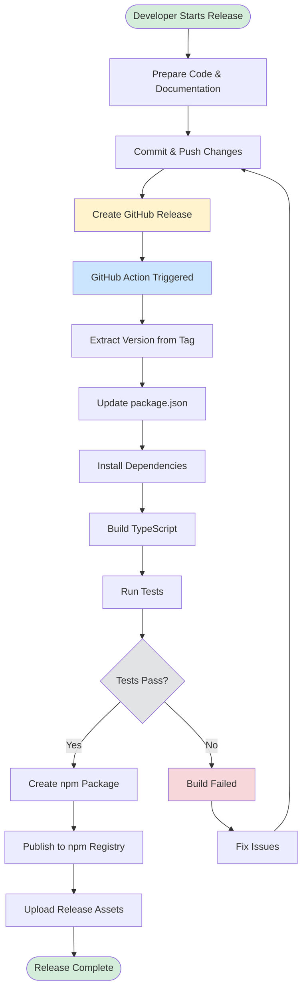

# Release Process

This document describes the automated release process for the WinCC OA MCP Server.

## Overview

The project uses GitHub Actions to automatically build and publish npm packages when a GitHub release is created. The version number from the GitHub release tag becomes the npm package version.

## Release Process Flow



### Process Steps

1. **Manual**: Developer creates GitHub release with version tag
2. **Automated**: GitHub Action workflow is triggered
3. **Automated**: Build, test, and publish to npm registry
4. **Automated**: Upload release assets to GitHub
5. **Manual**: Verify release and communicate to team

## Prerequisites

### 1. npm Token Setup

Before creating releases, ensure the npm token is configured:

1. **Create npm Access Token**:
   - Go to https://www.npmjs.com/settings/tokens
   - Click "Generate New Token" → "Automation"
   - Copy the generated token

2. **Add Token to GitHub Secrets**:
   - Go to GitHub Repository → Settings → Secrets and variables → Actions
   - Click "New repository secret"
   - Name: `NPM_TOKEN`
   - Value: [Your npm token]

### 2. npm Organization Access

Ensure your npm account has permissions to publish under the `@etm` scope:
- Contact npm to join the `@etm` organization, or
- Change the package name in `mcpWinCCOA/package.json` to use your own scope

## Release Workflow

### Step 1: Prepare for Release

1. **Ensure code is ready**:
   ```bash
   cd mcpWinCCOA
   npm test  # Run tests if available
   npm run build  # Verify build works
   ```

2. **Update documentation** if needed:
   - Update README files
   - Update field configurations
   - Update project configuration examples

3. **Commit and push all changes**:
   ```bash
   git add .
   git commit -m "Prepare for release vX.Y.Z"
   git push origin main
   ```

### Step 2: Create GitHub Release

1. **Go to GitHub repository**:
   - Navigate to https://github.com/winccoa/winccoa-ae-js-mcpserver
   - Click on "Releases" in the right sidebar

2. **Create new release**:
   - Click "Create a new release"
   - **Tag version**: Use semantic versioning (e.g., `v1.2.3` or `1.2.3`)
   - **Release title**: Use descriptive title (e.g., "Version 1.2.3 - Field Configuration Improvements")
   - **Description**: Add release notes describing changes

3. **Release types**:
   - **Regular release**: Check "Set as the latest release"
   - **Pre-release**: Check "Set as a pre-release" for beta versions
   - **Draft**: Save as draft to review before publishing

4. **Publish release**:
   - Click "Publish release"
   - GitHub Action will start automatically

### Step 3: Monitor Release Process

1. **Watch GitHub Action**:
   - Go to Actions tab in GitHub repository
   - Monitor the "Release and Publish to NPM" workflow
   - Check for any errors in the build process

2. **Verify npm publication**:
   - Check https://www.npmjs.com/package/@etm/winccoa-mcp-server
   - Verify new version appears within 1-2 minutes

3. **Download and test**:
   ```bash
   # Test global installation
   npm install -g @etm/winccoa-mcp-server@latest
   winccoa-mcp-stdio --help
   ```

## Version Numbering

Follow semantic versioning (SemVer):

- **Major version** (X.0.0): Breaking changes
- **Minor version** (X.Y.0): New features, backwards compatible
- **Patch version** (X.Y.Z): Bug fixes, backwards compatible

Examples:
- `v1.0.0` - Initial release
- `v1.1.0` - Added transport field configuration
- `v1.1.1` - Fixed field loader bug
- `v2.0.0` - Breaking changes to API

## Automated Build Process

The GitHub Action performs these steps:

1. **Extract version** from GitHub release tag
2. **Update package.json** with release version
3. **Install dependencies** in mcpWinCCOA directory
4. **Compile TypeScript** to JavaScript
5. **Create npm package** with correct metadata
6. **Publish to npm** with provenance
7. **Upload release assets** to GitHub

## File Structure After Build

```
@etm/winccoa-mcp-server/
├── build/                    # Compiled JavaScript
│   ├── index_stdio.js       # Main STDIO entry point
│   ├── index_http.js        # HTTP server entry point
│   ├── tool_oa.js          # WinCC OA tools
│   └── field_loader.js     # Field configuration loader
├── fields/                  # Field configurations (from parent directory)
│   ├── oil.md
│   ├── transport.md
│   ├── default.md
│   └── README.md
├── README.md               # npm package documentation
├── README_PROJECT_CONFIG.md # Project configuration guide
└── package.json           # Package metadata
```

## Troubleshooting

### Build Failures

**Error: "NPM_TOKEN not set"**
- Solution: Add NPM_TOKEN secret to GitHub repository

**Error: "Package name already exists"**
- Solution: Change package name in package.json or use different scope

**Error: "TypeScript compilation failed"**
- Solution: Fix TypeScript errors in source code

### npm Publishing Issues

**Error: "403 Forbidden"**
- Solution: Ensure npm account has permissions for @etm scope

**Error: "Version already published"**
- Solution: Create new release with incremented version number

**Package not visible on npm**
- Wait 1-2 minutes for npm registry to update
- Clear npm cache: `npm cache clean --force`

## Post-Release Tasks

1. **Update documentation**:
   - Update installation instructions if needed
   - Update examples with new version

2. **Announce release**:
   - Notify team members
   - Update project documentation
   - Consider creating changelog

3. **Monitor feedback**:
   - Watch for issues from users
   - Monitor npm download statistics
   - Check for bug reports

## Emergency Procedures

### Hotfix Release

For critical bugs:

1. Create hotfix branch: `git checkout -b hotfix/v1.2.1`
2. Fix the issue
3. Test thoroughly
4. Merge to main
5. Create immediate release with patch version

### Unpublish Package (Last Resort)

**Warning**: npm unpublish has strict limitations

```bash
# Only possible within 24 hours and if no dependents
npm unpublish @etm/winccoa-mcp-server@1.2.3
```

Better approach: Publish fixed version immediately

## Release Checklist

- [ ] Code changes tested and reviewed
- [ ] Documentation updated
- [ ] Version number follows SemVer
- [ ] NPM_TOKEN secret is configured
- [ ] All changes committed and pushed
- [ ] GitHub release created with proper tag
- [ ] GitHub Action completed successfully
- [ ] Package visible on npm registry
- [ ] Installation and basic functionality tested
- [ ] Release notes communicated to team
