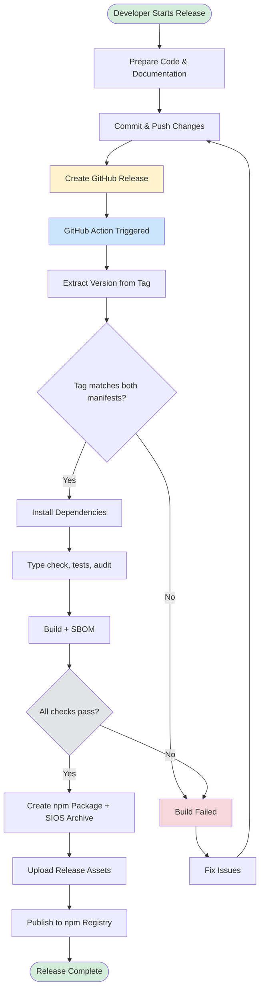

# Release Process

This document describes the automated release process for the WinCC OA MCP Server.

## Overview

The project uses GitHub Actions to automatically build and publish npm packages when a GitHub release is created.

**The repository is the source of truth for the version, not the tag.** The release workflow verifies
that the tag matches *both* `mcpWinCCOA/package.json` and `package.winccoa.json` (the SIOS manifest)
and fails if they disagree. So the version must be bumped in a commit **before** tagging.

This is deliberate: the workflow previously derived a version from the tag but used it only for the
tarball filename, so `npm publish` shipped whatever `package.json` said. Tagging `v1.5.0` against a
`1.4.0` manifest silently republished 1.4.0. Keeping the version in git history also means an audit can
see which commit a released version corresponds to.

## Release Process Flow


```mermaid
flowchart TD
    Start([Developer Starts Release]) --> Prepare[Prepare Code & Documentation]
    Prepare --> Commit[Commit & Push Changes]
    Commit --> Release[Create GitHub Release]
    Release --> Trigger[GitHub Action Triggered]
    
    Trigger --> Extract[Extract Version from Tag]
    Extract --> Verify{Tag matches both manifests?}
    Verify -->|No| Fail[Build Failed]
    Verify -->|Yes| Install[Install Dependencies]
    Install --> Test[Type check, tests, audit]
    Test --> Build[Build + SBOM]
    Build --> TestResult{All checks pass?}
    TestResult -->|No| Fail[Build Failed]
    TestResult -->|Yes| Package[Create npm Package + SIOS Archive]
    
    Package --> Upload[Upload Release Assets]
    Upload --> Publish[Publish to npm Registry]
    Publish --> Complete([Release Complete])
    
    Fail --> Fix[Fix Issues]
    Fix --> Commit
    
    style Start fill:#d4edda
    style Release fill:#fff3cd
    style Trigger fill:#cce5ff
    style Complete fill:#d4edda
    style Fail fill:#f8d7da
    style TestResult fill:#e2e3e5
```

### Process Steps

1. **Manual**: Bump the version in `mcpWinCCOA/package.json` **and** `package.winccoa.json`, update
   `CHANGELOG.md`, commit and push
2. **Manual**: Create the GitHub release with a tag matching that version
3. **Automated**: workflow verifies version consistency, then type check, tests and `npm audit`
4. **Automated**: build, generate the SBOM, publish to npm with provenance
5. **Automated**: upload the tarball and `sbom.json` as release assets
6. **Manual**: verify the release, then hand off to SIOS

## Prerequisites

### 1. npm Token Setup

Before creating releases, ensure the npm token is configured:

1. **Create npm Access Token**:
   - Go to https://www.npmjs.com/settings/tokens
   - Click "Generate New Token" → "Automation"
   - Copy the generated token

2. **Add Token to GitHub Secrets**:
   - Go to GitHub Repository → Settings → Secrets and variables → Actions
   - Click "New repository secret"
   - Name: `NPM_TOKEN`
   - Value: [Your npm token]

### 2. npm Organization Access

Ensure your npm account has permissions to publish under the `@etm-professional-control` scope:
- Contact npm to join the `@etm-professional-control` organization, or
- Change the package name in `mcpWinCCOA/package.json` to use your own scope

## Release Workflow

### Step 1: Prepare for Release

1. **Ensure code is ready**:
   ```bash
   cd mcpWinCCOA
   npm ci
   npx tsc --noEmit
   npm test
   npm run build
   npm run sbom
   npm audit --audit-level=high
   ```

2. **Bump the version in both manifests** — they must match the tag you are about to create:
   ```bash
   # mcpWinCCOA/package.json  -> "version"
   # package.winccoa.json     -> "Version"
   ```

3. **Update documentation** if needed:
   - Update README files
   - Update field configurations
   - Update `CHANGELOG.md`
   - Update `OSS.md` if dependencies changed

4. **Commit and push all changes**:
   ```bash
   git add .
   git commit -m "Prepare for release vX.Y.Z"
   git push origin main
   ```

### Step 2: Create GitHub Release

1. **Go to GitHub repository**:
   - Navigate to https://github.com/winccoa/winccoa-ae-js-mcpserver
   - Click on "Releases" in the right sidebar

2. **Create new release**:
   - Click "Create a new release"
   - **Tag version**: Use semantic versioning (e.g., `v1.2.3` or `1.2.3`)
   - **Release title**: Use descriptive title (e.g., "Version 1.2.3 - Field Configuration Improvements")
   - **Description**: Add release notes describing changes

3. **Release types**:
   - **Regular release**: Check "Set as the latest release"
   - **Pre-release**: Check "Set as a pre-release" for beta versions
   - **Draft**: Save as draft to review before publishing

4. **Publish release**:
   - Click "Publish release"
   - GitHub Action will start automatically

### Step 3: Monitor Release Process

1. **Watch GitHub Action**:
   - Go to Actions tab in GitHub repository
   - Monitor the "Release and Publish to NPM" workflow
   - Check for any errors in the build process

2. **Verify npm publication**:
   - Check https://www.npmjs.com/package/@etm-professional-control/winccoa-mcp-server
   - Verify new version appears within 1-2 minutes

3. **Download and test**:
   ```bash
   # Test global installation
   npm install -g @etm-professional-control/winccoa-mcp-server@latest
   winccoa-mcp-stdio --help
   ```

## Version Numbering

Follow semantic versioning (SemVer):

- **Major version** (X.0.0): Breaking changes
- **Minor version** (X.Y.0): New features, backwards compatible
- **Patch version** (X.Y.Z): Bug fixes, backwards compatible

Examples:
- `v1.0.0` - Initial release
- `v1.1.0` - Added transport field configuration
- `v1.1.1` - Fixed field loader bug
- `v2.0.0` - Breaking changes to API

## Automated Build Process

The GitHub Action runs **two jobs**. `release-assets` produces everything attached to the GitHub
release; `publish-npm` then publishes to the registry. They are separate because the release artifacts
do not come from npm, so a registry credential problem must not leave the release with no assets.

`release-assets`:

1. **Extract version** from the GitHub release tag
2. **Verify** the tag matches `package.json` and `package.winccoa.json` — fails the job if not
3. **Install dependencies** in `mcpWinCCOA`
4. **Type check**, **run the tests**, and **`npm audit --audit-level=high`**
5. **Build** via `npm run build` (the same `build.mjs` used locally, so there is one recipe)
6. **Stage** `README.md`, `OSS.md`, `LEGAL_INFO.md` and `LICENSE.md` into the package directory
7. **Generate the SBOM** (`sbom.json`), so it matches the published artifact
8. **Pack** the npm tarball and **build the SIOS archive** (`npm run zip`)
9. **Upload** the tarball, the SBOM and the SIOS archive as release assets

`publish-npm` (needs `release-assets`):

10. Repeat install, build, document staging and SBOM generation
11. **Publish to npm** with provenance

The build is repeated rather than carried over as an artifact, so that `npm publish` stays identical to
the invocation that has always worked instead of switching to publishing a pre-packed tarball.

The package contents come from the committed `files` array in `package.json`. The workflow no longer
injects metadata with `npm pkg set` — every field it used to write was already in `package.json`, which
made the two able to drift.

## File Structure After Build

As published (from the `files` array in `package.json`):

```
@etm-professional-control/winccoa-mcp-server/
├── build/                   # Compiled JavaScript + copied runtime assets
│   ├── index_http.js        # HTTP server entry point
│   ├── index_stdio.js       # STDIO entry point
│   ├── systemprompt.md
│   ├── fields/              # default.md, oil.md, transport.md
│   ├── config/              # demo-project-instructions.md
│   ├── helpers/  tools/  types/  utils/
├── src/fields/              # source copies, used by postinstall
├── src/systemprompt.md
├── config/
├── postinstall.cjs          # copies build output into the WinCC OA project
├── .env.example
├── sbom.json                # CycloneDX SBOM for this exact version
├── README.md
├── OSS.md                   # third-party software disclosure
├── LEGAL_INFO.md
├── LICENSE.md
└── package.json
```

`winccoa-manager` is **never** included: it is proprietary Siemens code supplied by the WinCC OA
installation and declared as an optional `peerDependency`. It is also excluded from `sbom.json`.

## Troubleshooting

### Build Failures

**Error: "NPM_TOKEN not set"**
- Solution: Add NPM_TOKEN secret to GitHub repository

**Error: "Package name already exists"**
- Solution: Change package name in package.json or use different scope

**Error: "TypeScript compilation failed"**
- Solution: Fix TypeScript errors in source code

### npm Publishing Issues

**Error: "403 Forbidden"**
- Solution: Ensure npm account has permissions for @etm scope

**Error: "Version already published"**
- Solution: Create new release with incremented version number

**Package not visible on npm**
- Wait 1-2 minutes for npm registry to update
- Clear npm cache: `npm cache clean --force`

## Post-Release Tasks

1. **Update documentation**:
   - Update installation instructions if needed
   - Update examples with new version

2. **Announce release**:
   - Notify team members
   - Update project documentation
   - Consider creating changelog

3. **Monitor feedback**:
   - Watch for issues from users
   - Monitor npm download statistics
   - Check for bug reports

## Emergency Procedures

### Hotfix Release

For critical bugs:

1. Create hotfix branch: `git checkout -b hotfix/v1.2.1`
2. Fix the issue
3. Test thoroughly
4. Merge to main
5. Create immediate release with patch version

### Unpublish Package (Last Resort)

**Warning**: npm unpublish has strict limitations

```bash
# Only possible within 24 hours and if no dependents
npm unpublish @etm-professional-control/winccoa-mcp-server@1.2.3
```

Better approach: Publish fixed version immediately

## Release Checklist

- [ ] Code changes tested and reviewed
- [ ] Documentation updated
- [ ] Version number follows SemVer
- [ ] **`mcpWinCCOA/package.json` version bumped**
- [ ] **`package.winccoa.json` `Version` bumped to match** (the release job fails otherwise)
- [ ] **`CHANGELOG.md` updated**
- [ ] `npm audit --audit-level=high` clean locally
- [ ] `OSS.md` reflects any dependency change, and SVM entries updated
- [ ] NPM_TOKEN secret is configured
- [ ] All changes committed and pushed
- [ ] GitHub release created with a tag matching the bumped version
- [ ] GitHub Action completed successfully
- [ ] Package visible on npm registry
- [ ] Installation and basic functionality tested
- [ ] Release notes communicated to team
